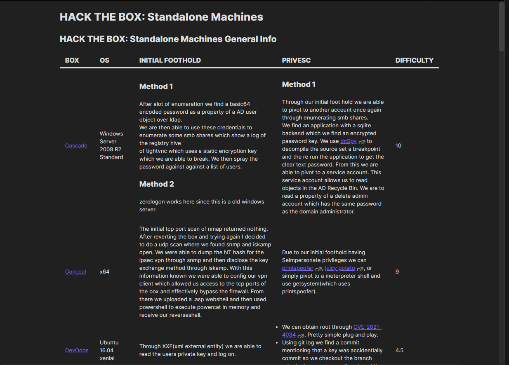
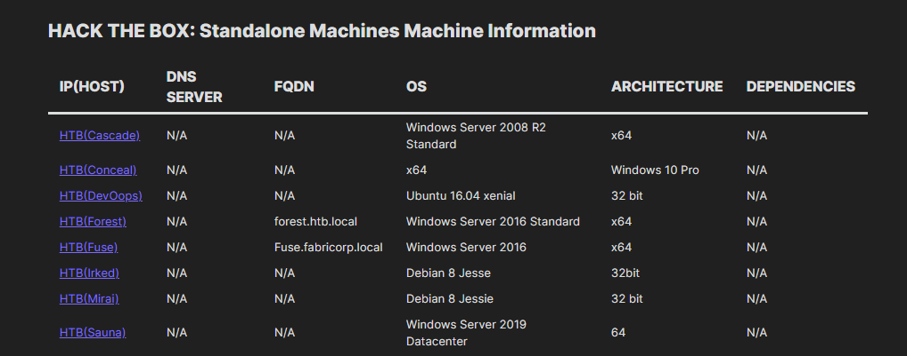
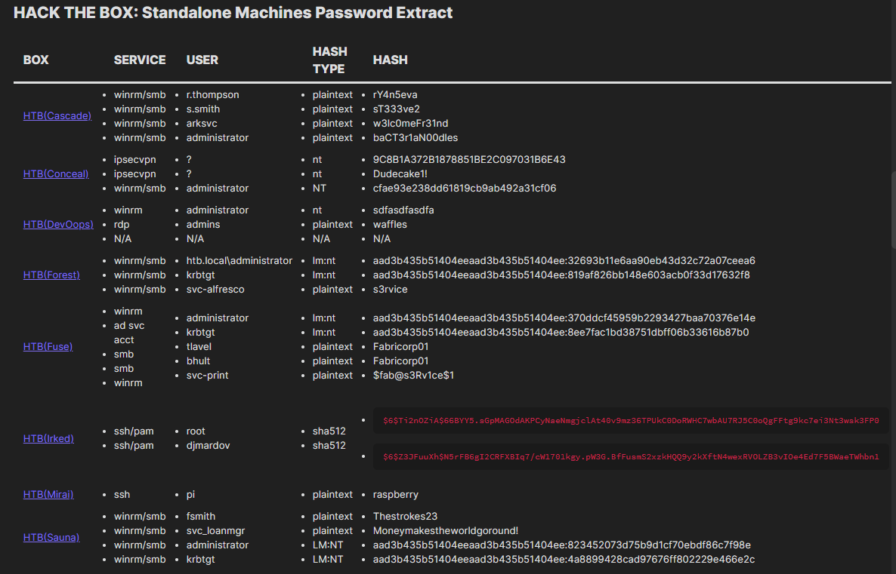
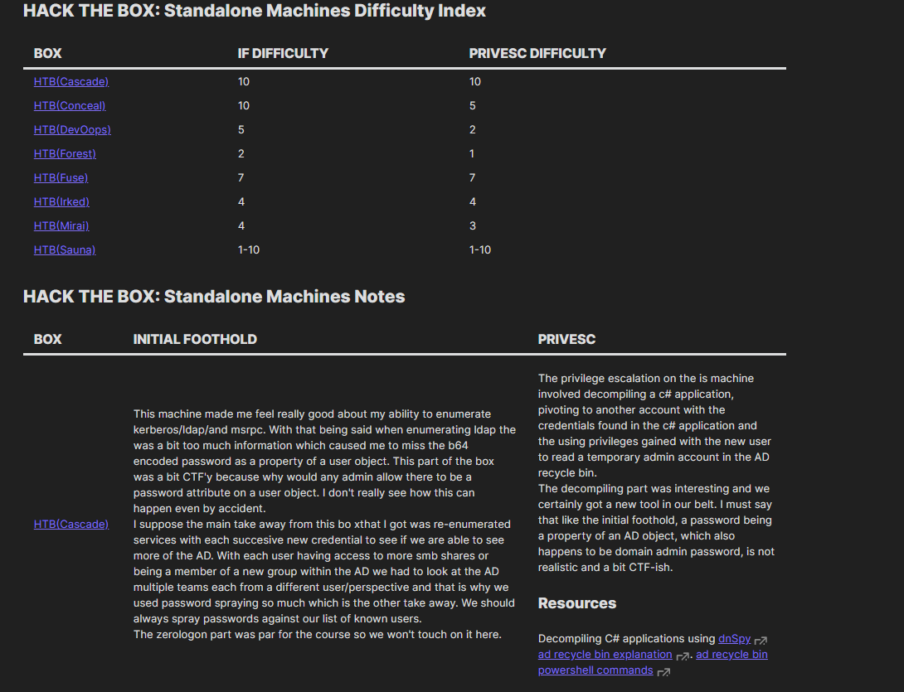

# REPORT TEMPLATES
Templates for documenting ctf's or network based pentests.

## Foreword
The writeup-dataview-template.md is a living document.  
As such it is update when new information/techniques are learned.  
A secondary goal of this template is to focus on ***what to look for not*** first and ***how to look for*** second.  
By focusing on ***what*** instead of ***how***, we can check off low hanging fruit by thinking in terms of the OS flavor and not get overwhelmed with all the various commands or mindlessly running them.    
For example, How do we enum users?  
### On Windows
All users? 
```powershell
net user
```
Administrators?
```powershell
net localgroup administrators
```
### On Linux
Users with login shells?  
```bash
cat /etc/passwd | cut -d ':' -f 1,7 | grep "zsh\|sh\|bash"
```
```bash
cat /etc/passwd | awk -F ":" '{print $1 ":" $7}' | grep "zsh\|sh\|bash"
```

***What*** we doing is looking for users.  
***How*** we look for users depends on the OS.  

## Usage
Create your working folders.
```powershell
. .\New-Host.ps1; New-Host -HostName example -Verbose
```

## A couple of things worth mentioning:
- For a writeup to appear in the index you must move it into the finished folder.
- You cheat yourself when you look at a writeup before using all of the enumeration you know at a point in time, whether you use this template, your own, or someone else's.  

With your working folders created you can create an obsidian vault at the root of this project and get to hacking!

# Template Windows
T0 D0
# Template Linux
T0 D0
# Index





T0 D0


